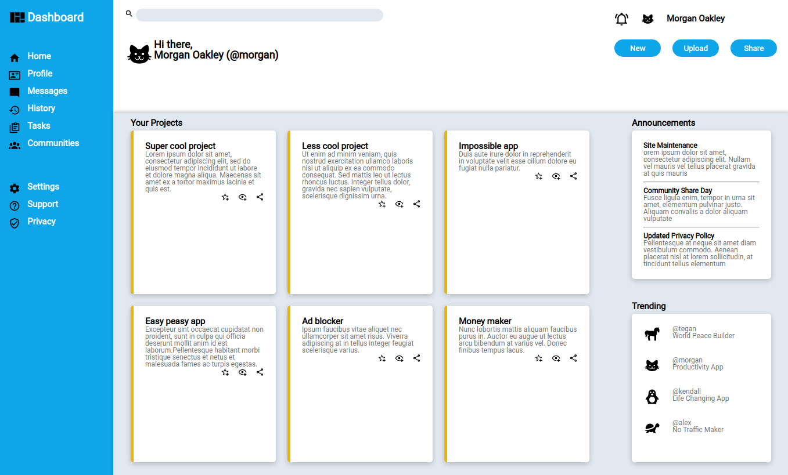

# Dashboard

## Links
* <a href="https://rawcdn.githack.com/lhtn/dashboard/06e026d9908c23e8d3e8d7e4f66343710a33c548/index.html">Live demo</a>
* <a href="https://www.theodinproject.com/lessons/node-path-intermediate-html-and-css-admin-dashboard">Link to the assignment</a>

## About
Dashboard is a dashboard design mostly using CSS Grid. This project is part of the Full-Stack Javascript curriculum of The Odin Project.

## Built with
* HTML
* CSS